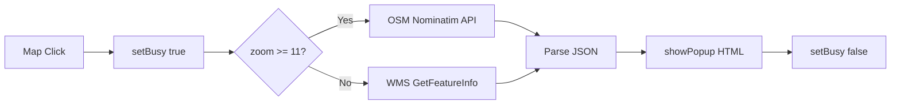
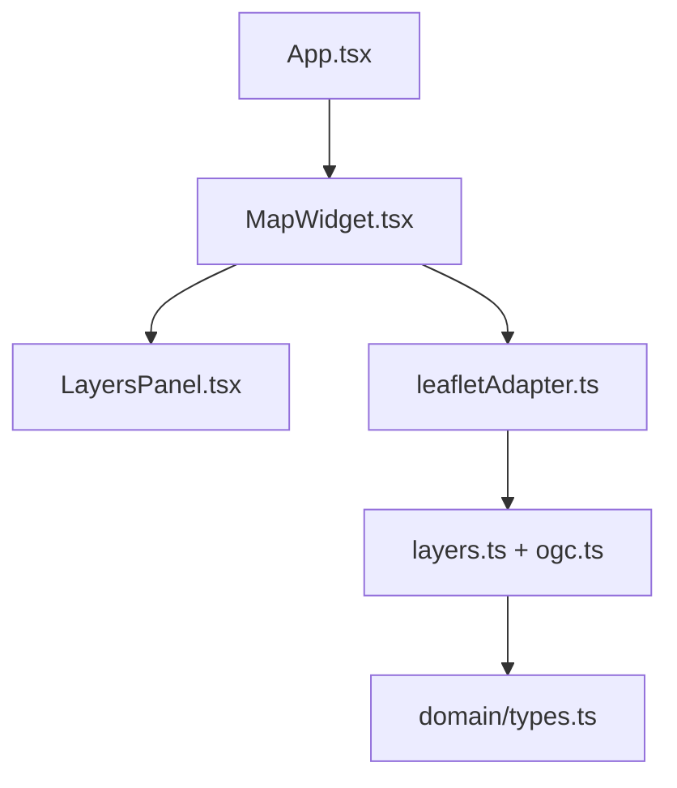

# Progis Map App - Technical Review

## Overview

- **Stack**: React 19.1.1 + TypeScript 5.9.3 + Leaflet 1.9.4 + Vite 7.1.7
- **Architecture**: Clean Architecture принципы (domain/infrastructure/ui/shared)
- **OGC Services**: WMS GetMap + GetFeatureInfo, OSM Nominatim reverse geocoding
- **Deploy**: GitHub Pages с автоматической сборкой
- **Development**: Строгий TypeScript, ESLint + Prettier, современные React patterns

## Structure

```
src/
├── app/                    # Пустые папки store/services (подготовка)
├── domain/                 # Типы, порты, use-cases (бизнес-логика)
├── infrastructure/
│   ├── map/leafletAdapter.ts    # Leaflet обертка + WMS GetFeatureInfo
│   ├── mocks/              # Моки для OGC сервисов
│   └── ogc/                # OGC клиенты
├── shared/
│   ├── config/             # Конфигурация слоев и OGC эндпоинтов
│   └── lib/format.ts       # Утилиты (titleCase)
└── ui/
    ├── components/LayersPanel.tsx  # Переключатель слоев
    └── widgets/MapWidget.tsx       # Основной компонент карты
```

**Зависимости**: `widgets → infrastructure → shared` | `domain` изолирован

## Map & OGC

**Карта**: Создается в `leafletAdapter.createMap()`, OSM базовый слой + переменные WMS

**WMS Эндпоинты**:

- `https://ows.terrestris.de/osm/service` (OSM-WMS overlay)
- `/wms` (для ne:ne_10m_admin_0_countries) - локальный GeoServer

**GetFeatureInfo**:

```typescript
// src/infrastructure/map/leafletAdapter.ts:109
export async function identifyWms(
  h: MapHandle,
  ll: L.LatLng,
  baseUrl: string,
  params: { layers: string; infoFormat?: string },
);
```

- **Формат**: WMS 1.1.1, EPSG:4326, application/json
- **Hybrid mode**: zoom >= 11 → OSM Nominatim, иначе → WMS GFI countries

**Popup**: React-free HTML в `showPopup()`, табличное отображение атрибутов

## Flows





**Состояние**: Локальный state в MapWidget (`visible: Record<string, boolean>`, `busy`, `ready`)

## Error/Perf/DX

**Ошибки**:

- WMS/Nominatim: try/catch с fallback, error popup display
- Geolocation: silent fail → default USA center
- Нет централизованного error boundary

**Производительность**:

- requestAnimationFrame в setView для избежания гонок
- Простая защита от дублирующих кликов (`busy` флаг)
- Нет кэширования WMS/features responses

**DX**:

- Простой запуск `npm run dev`
- Конфиг слоев в `shared/config/layers.ts` (легко расширяемый)
- Документация в `docs/` папке

## Lint/Type/Test

**TypeScript**: Строгий mode + noUnusedLocals/Parameters, ES2022 target
**ESLint**: Современная конфигурация с typescript-eslint + react-hooks
**Prettier**: `singleQuote: true, trailingComma: 'all'`
**Тесты**: ❌ Отсутствуют

**Запуск**:

- `npm run lint` - ESLint проверка
- `npm run build` - TypeScript проверка + сборка
- Нет отдельного `typecheck` скрипта

## README/Run

✅ **README хороший**: установка, запуск, архитектура, фичи, демо ссылка

**Улучшения**:

```bash
# Добавить в package.json
"typecheck": "tsc --noEmit",
"format": "prettier --write src",
"test": "echo \"No tests yet\" && exit 1"
```

## Code Samples

**MapWidget identify logic** (`src/ui/widgets/MapWidget.tsx:48-89`):

```typescript
onMapClick(handle, async (ll) => {
  if (busy) return;
  setBusy(true);
  const zoom = handle.map.getZoom();

  if (zoom >= 11) {
    // High zoom → reverse geocode (OSM Nominatim)
    const url = new URL('https://nominatim.openstreetmap.org/reverse');
    // ... build URL & fetch
  } else {
    // Low zoom → WMS GFI (countries)
    const url = await identifyWms(handle, ll, WMS_URL, {
      layers: 'ne:ne_10m_admin_0_countries',
    });
  }
});
```

**WMS URL builder** (`src/infrastructure/map/leafletAdapter.ts:85-106`):

```typescript
function buildGfiUrl(h: MapHandle, baseUrl: string, params: {...}) {
  const bbox = [sw.lng, sw.lat, ne.lng, ne.lat].join(',');
  url.searchParams.set('SERVICE', 'WMS');
  url.searchParams.set('REQUEST', 'GetFeatureInfo');
  url.searchParams.set('SRS', 'EPSG:4326');
  url.searchParams.set('BBOX', bbox);
}
```

## Strengths / Improvements / Risks

### ✅ Strengths

1. **Clean Architecture**: Четкое разделение domain/infrastructure/ui
2. **Modern Stack**: React 19, TypeScript strict mode, Vite hot reload
3. **Smart Identify**: Hybrid approach (Nominatim + WMS) зависимо от зума

### 🔧 High ROI Improvements

1. **Добавить тесты**: `identifyWms()`, `MapWidget mount`, `LayersPanel toggle`
2. **Error Boundary**: Глобальная обработка React errors
3. **Кэширование**: WMS capabilities + features (Map/WeakMap)

### ⚠️ Risks

1. **CORS**: Внешние WMS могут блокировать запросы
2. **CRS Mismatch**: Hardcoded EPSG:4326, нет трансформаций
3. **No Authentication**: OGC сервисы могут требовать авторизации
4. **XML Parsing**: GetFeatureInfo может вернуть XML вместо JSON

---

**Review completed**: 2 min read time for team leads
